# Used Item Market 项目功能逻辑说明

本项目是一个校园二手闲置交易平台，当前代码已经整理为前后端分离的业务形态：前端负责页面交互和接口调用，后端提供 `/api/**` REST 接口，数据库使用 MySQL 保存用户、商品、订单、购物车、收藏、聊天、求购等数据。

这份 README 只说明当前项目已经实现的功能、功能调用流程，以及这些功能在代码中的主要位置，便于后续逐项审核和改进。

## 一、整体技术与数据流

当前项目的主流程可以理解为：

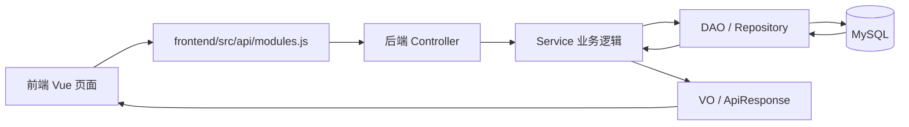

### 当前使用的主要技术

| 层 | 当前技术 | 主要作用 |
| --- | --- | --- |
| 前端 | Vue 3、Vite、Vue Router、Pinia、Axios | 页面展示、路由跳转、登录状态保存、接口请求 |
| 后端 Web | Spring MVC | 接收 HTTP 请求，返回 JSON |
| 后端业务 | Spring Service、事务注解 | 参数校验、权限判断、业务状态流转 |
| 数据访问 | MyBatis Mapper、JdbcTemplate Repository | 执行 SQL，读写 MySQL |
| 鉴权 | JWT、AuthInterceptor | 登录后携带 Token 访问受保护接口 |
| 文件上传 | Commons FileUpload、FileStorageService、`/img/**` 静态映射 | 保存商品图片并返回图片访问路径 |

当前数据访问层同时存在 MyBatis DAO 和 JdbcTemplate Repository：

- `dao`：主要承接原有核心表操作，例如用户、商品、购物车、订单、卖家商品关联。
- `repository`：主要承接后续新增或后台聚合类功能，例如地址、收藏、聊天、求购、分类、后台统计。

## 二、当前项目结构

### 后端目录

| 目录 | 作用 |
| --- | --- |
| `backend/src/main/java/com/useditemmarket/controller/api` | REST 接口入口，负责接收前端请求、读取登录用户、调用 Service |
| `backend/src/main/java/com/useditemmarket/dto` | 前端提交给后端的请求对象，例如登录、注册、发布商品、下单 |
| `backend/src/main/java/com/useditemmarket/service/api` | 业务接口定义 |
| `backend/src/main/java/com/useditemmarket/service/api/impl` | 业务实现，核心功能逻辑主要在这里 |
| `backend/src/main/java/com/useditemmarket/service/support` | 业务支撑服务，目前主要是图片存储 `FileStorageService` |
| `backend/src/main/java/com/useditemmarket/dao` | MyBatis Mapper 接口 |
| `backend/src/main/java/com/useditemmarket/repository` | JdbcTemplate 数据访问类 |
| `backend/src/main/java/com/useditemmarket/po` | 数据库持久化对象，对应数据库表字段 |
| `backend/src/main/java/com/useditemmarket/vo` | 返回给前端展示的视图对象 |
| `backend/src/main/java/com/useditemmarket/model` | 业务枚举和上下文对象，例如商品状态、订单状态、登录用户上下文 |
| `backend/src/main/java/com/useditemmarket/security` | JWT 生成解析、请求拦截鉴权 |
| `backend/src/main/java/com/useditemmarket/exception` | 业务异常和全局异常处理 |
| `backend/src/main/java/com/useditemmarket/config` | 数据库初始化/迁移辅助逻辑 |
| `backend/src/main/java/com/useditemmarket/response` | 统一响应结构 `ApiResponse`、分页响应 `PageResponse` |
| `backend/src/main/java/com/useditemmarket/util` | 当前仍在使用的工具类，例如 MD5、字符串校验 |

### 后端资源目录

| 目录/文件 | 作用 |
| --- | --- |
| `backend/src/main/resources/spring-mvc.xml` | Spring MVC 配置：Controller 扫描、JSON 接口、文件上传、跨域、鉴权拦截、`/img/**` 静态资源 |
| `backend/src/main/resources/spring-mybatis.xml` | Spring、MyBatis、数据源、事务、JdbcTemplate 配置 |
| `backend/src/main/resources/mapping/*.xml` | MyBatis SQL 映射文件 |
| `backend/src/main/resources/jdbc.properties.example` | 数据库连接配置示例 |
| `backend/src/main/resources/log4j.properties`、`log4j2.xml` | 日志配置 |
| `backend/src/main/webapp/WEB-INF/web.xml` | 传统 WAR 项目的 Web 容器入口配置 |
| `backend/src/main/webapp/img` | 本地演示时的商品图片访问目录 |

### 前端目录

| 目录/文件 | 作用 |
| --- | --- |
| `frontend/src/views` | 页面组件，例如市场、详情、发布、购物车、订单、后台页面 |
| `frontend/src/api/http.js` | Axios 实例，统一加 Token，统一处理接口错误 |
| `frontend/src/api/modules.js` | 按业务模块封装接口调用 |
| `frontend/src/stores/auth.js` | Pinia 登录状态，保存 Token 和当前用户 |
| `frontend/src/router/index.js` | 前端路由和登录/管理员路由守卫 |
| `frontend/src/layouts` | 普通用户布局、管理员布局 |
| `frontend/src/components` | 通用组件，例如商品卡片、状态标签 |

### 测试目录

当前 `backend/src/test` 没有有效测试文件，项目目前主要依靠手动启动和页面操作验证功能。

## 三、核心功能总览

| 功能 | 前端页面 | 后端 Controller | Service | 数据访问 |
| --- | --- | --- | --- | --- |
| 注册、登录、当前用户 | `LoginPage.vue`、`RegisterPage.vue` | `AuthController` | `AuthServiceImpl` | `UserDao`、`JwtTokenService` |
| 商品列表、商品详情、分类 | `MarketPage.vue`、`GoodsDetailPage.vue` | `CatalogController` | `CatalogServiceImpl` | `GoodsDao`、`SalesDao`、`UserDao`、`CategoryRepository` |
| 发布/编辑/下架商品 | `PublishGoodsPage.vue`、`EditGoodsPage.vue`、`SellerGoodsPage.vue` | `SellerGoodsController` | `SellerGoodsServiceImpl` | `GoodsDao`、`SalesDao`、`FileStorageService` |
| 图片上传 | `PublishGoodsPage.vue`、`EditGoodsPage.vue` | `SellerGoodsController` | `SellerGoodsServiceImpl` | `FileStorageService` |
| 购物车 | `CartPage.vue` | `CartController` | `CartServiceImpl` | `CarDao`、`GoodsDao`、`SalesDao` |
| 下单、购买记录、销售记录 | `GoodsDetailPage.vue`、`CartPage.vue`、`PurchasesPage.vue`、`SalesPage.vue` | `OrderController` | `OrderServiceImpl` | `RecordDao`、`SRecordDao`、`SalesDao`、`AddressRepository` |
| 收货地址 | `ProfilePage.vue`、下单相关页面 | `AddressController` | `AddressServiceImpl` | `AddressRepository` |
| 收藏 | `FavoritesPage.vue`、商品详情/卡片 | `FavoriteController` | `FavoriteServiceImpl` | `FavoriteRepository` |
| 私信聊天 | `MessagesPage.vue` | `ChatController` | `ChatServiceImpl` | `ChatRepository` |
| 求购信息 | `WantedPage.vue` | `WantedController` | `WantedServiceImpl` | `WantedRepository` |
| 个人资料、修改密码 | `ProfilePage.vue` | `ProfileController` | `ProfileServiceImpl` | `UserDao` |
| 管理员用户管理 | `AdminUsersPage.vue` | `AdminApiController` | `AdminUserServiceImpl` | `UserDao`、`RecordDao`、`SalesDao`、`GoodsDao` |
| 管理员商品审核 | `AdminGoodsPage.vue` | `AdminApiController` | `AdminOpsServiceImpl` | `AdminRepository`、`GoodsDao` |
| 管理员分类管理 | `AdminCategoriesPage.vue` | `AdminApiController` | `AdminOpsServiceImpl` | `CategoryRepository` |
| 管理员仪表盘 | `AdminDashboardPage.vue` | `AdminApiController` | `AdminOpsServiceImpl` | `AdminRepository` |

## 四、登录注册与鉴权流程

### 注册流程

注册入口：

- 前端页面：`frontend/src/views/RegisterPage.vue`
- 前端接口：`frontend/src/api/modules.js` 中的 `authApi.register`
- 后端接口：`POST /api/auth/register`
- 后端文件：`AuthController`、`AuthServiceImpl`、`UserDao`

注册时，后端会校验学号、用户名、密码、确认密码、邮箱和手机号。普通用户 UID 按 `NORM + 学号` 生成。注册前会调用 `userDao.SelectUser(uid)` 检查是否已存在，密码使用 `Md5Util.getMD5` 后写入 `user` 表。

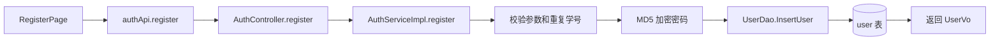

### 登录流程

登录入口：

- 前端页面：`frontend/src/views/LoginPage.vue`
- 前端状态：`frontend/src/stores/auth.js`
- 后端接口：`POST /api/auth/login`
- 后端文件：`AuthController`、`AuthServiceImpl`、`JwtTokenService`

登录时，后端用学号和 MD5 密码调用 `userDao.IsTrue` 查用户 UID。管理员登录会检查 UID 是否以 `ADMI` 开头，普通用户登录则要求不是管理员 UID。登录成功后，`JwtTokenService` 生成 JWT，前端将 Token 保存到 `localStorage`。

后续访问受保护接口时，`frontend/src/api/http.js` 会自动加上：

```text
Authorization: Bearer <token>
```

后端 `AuthInterceptor` 会解析 Token，把当前用户放入 `AuthContext`，Controller 再通过 `AuthContext.get().getUid()` 获取当前登录用户。

```mermaid
flowchart LR
    A[LoginPage] --> B[authApi.login]
    B --> C[AuthController.login]
    C --> D[AuthServiceImpl.login]
    D --> E[UserDao.IsTrue]
    E --> F[校验角色和账号状态]
    F --> G[JwtTokenService.generateToken]
    G --> H[前端保存 token]
    H --> I[后续请求携带 Authorization]
    I --> J[AuthInterceptor 解析 token]
    J --> K[AuthContext 保存当前用户]
```

## 五、商品浏览与分类流程

商品浏览入口：

- 前端页面：`MarketPage.vue`、`HomePage.vue`、`GoodsDetailPage.vue`
- 前端接口：`catalogApi.list`、`catalogApi.detail`、`catalogApi.categories`
- 后端接口：`GET /api/catalog/goods`、`GET /api/catalog/goods/{gid}`、`GET /api/catalog/categories`
- 后端文件：`CatalogController`、`CatalogServiceImpl`、`GoodsDao`、`SalesDao`、`UserDao`、`CategoryRepository`

商品列表接口是公开接口，不需要登录。后端读取 `marketgoods` 中 `ACTIVE` 且库存大于 0 的商品，再过滤掉管理员账号发布的商品。之后根据关键字、分类、排序和分页参数处理列表，最终组装为 `GoodsVo` 返回前端。

分类列表来自 `goods_category` 表，普通用户侧只返回 `Enabled = 1` 的分类。

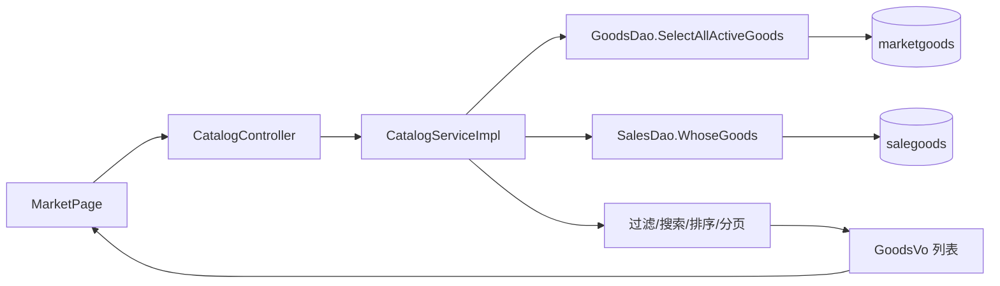

## 六、用户发布商品与图片上传流程

发布商品涉及两个动作：先上传图片，后提交商品信息。

相关代码：

- 前端页面：`PublishGoodsPage.vue`、`EditGoodsPage.vue`
- 前端接口：`sellerApi.uploadImage`、`sellerApi.create`、`sellerApi.update`
- 后端接口：`POST /api/seller/goods/upload-image`、`POST /api/seller/goods`、`PUT /api/seller/goods/{gid}`
- 后端文件：`SellerGoodsController`、`SellerGoodsServiceImpl`、`FileStorageService`、`GoodsDao`、`SalesDao`

### 图片上传逻辑

前端选择图片后，用 `FormData` 发送字段 `imageFile` 到 `/api/seller/goods/upload-image`。后端流程如下：

1. `SellerGoodsController.uploadImage` 接收 `MultipartFile imageFile`。
2. `SellerGoodsServiceImpl.uploadImage` 校验当前用户必须是普通用户。
3. `FileStorageService.saveImage` 校验文件：
   - 文件不能为空；
   - 文件大小不能超过 5MB；
   - 后缀只允许 `jpg`、`jpeg`、`png`、`gif`、`webp`。
4. 后端按 `webapp/img/{uid}/{uuid}.{ext}` 保存图片。
5. 返回前端可访问路径，例如 `/img/NORM20240001/xxxx.png`。
6. `spring-mvc.xml` 中的 `<mvc:resources mapping="/img/**" location="/img/"/>` 负责让浏览器能访问这些图片。

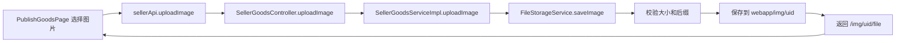

### 商品发布逻辑

图片上传成功后，前端把返回的图片路径放入商品表单，再提交商品信息。后端发布商品时会：

1. 校验用户是普通用户，且通过校园认证。
2. 校验商品名称、分类、价格、库存、交付方式。
3. 生成新的 `GID`。
4. 创建 `MarketGoods`，状态设置为 `PENDING_REVIEW`。
5. 调用 `goodsDao.InsertGoods` 写入 `marketgoods` 表。
6. 调用 `salesDao.InsertGoods` 写入 `salegoods` 表，建立卖家和商品的关系。
7. 返回 `GoodsVo` 给前端。

新发布或编辑后的商品不会直接出现在市场列表，必须等待管理员审核通过后状态变为 `ACTIVE`。

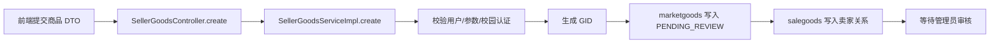

### 编辑和下架逻辑

- 编辑商品：`SellerGoodsServiceImpl.update` 会先校验商品归属，更新商品字段，并把状态重新设置为 `PENDING_REVIEW`。
- 下架商品：`SellerGoodsServiceImpl.delete` 不直接删除数据库记录，而是把库存设为 `0`，状态设为 `OFF_SHELF`。

## 七、管理员商品审核流程

管理员入口：

- 前端布局：`AdminLayout.vue`
- 前端页面：`AdminGoodsPage.vue`、`AdminDashboardPage.vue`、`AdminCategoriesPage.vue`
- 前端接口：`adminApi.pendingGoods`、`adminApi.goods`、`adminApi.reviewGoods`
- 后端接口：`GET /api/admin/goods/pending`、`GET /api/admin/goods`、`POST /api/admin/goods/{gid}/review`
- 后端文件：`AdminApiController`、`AdminOpsServiceImpl`、`AdminRepository`、`GoodsDao`

管理员接口会先调用 `requireAdmin()`，要求当前 JWT 中的 `admin = true`。商品审核由 `AdminOpsServiceImpl.reviewGoods` 处理：

| 操作 | 请求 action | 商品状态变化 | 说明 |
| --- | --- | --- | --- |
| 通过 | `approve` | `PENDING_REVIEW` -> `ACTIVE` | 商品进入市场列表 |
| 驳回 | `reject` | `PENDING_REVIEW` -> `REJECTED` | 保存审核备注 |
| 封禁 | `ban` | 任意状态 -> `BANNED`，库存设为 0 | 违规商品下架 |

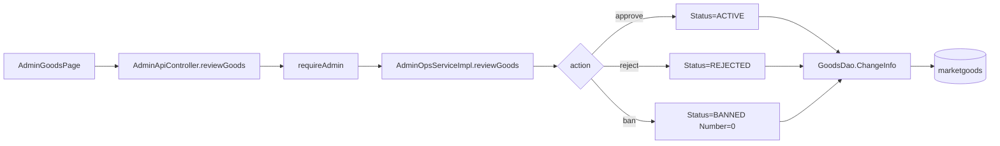

管理员后台还实现了：

- 用户管理：查看普通用户、修改资料、重置密码、停用用户。
- 停用用户：会把该用户发布的商品状态改为 `BANNED`，库存设为 `0`。
- 订单查看：读取全部交易记录。
- 分类管理：新增或更新 `goods_category`。
- 仪表盘：统计商品、订单、停用用户、开放求购数量。

## 八、购物车与下单流程

购物车入口：

- 前端页面：`CartPage.vue`
- 前端接口：`cartApi.list`、`cartApi.add`、`cartApi.update`、`cartApi.remove`
- 后端接口：`/api/cart`
- 后端文件：`CartController`、`CartServiceImpl`、`CarDao`

加入购物车时，后端会校验：

- 当前用户必须是普通用户；
- 商品存在；
- 商品不能是管理员商品；
- 不能购买自己的商品；
- 加购数量不能超过库存。

购物车数据保存在 `shoppingcart` 表。

### 下单流程

下单入口：

- 前端页面：`GoodsDetailPage.vue`、`CartPage.vue`
- 前端接口：`orderApi.create`
- 后端接口：`POST /api/orders`
- 后端文件：`OrderController`、`OrderServiceImpl`、`GoodsDao`、`SalesDao`、`RecordDao`、`CarDao`、`AddressRepository`

下单时，`OrderServiceImpl.createOrder` 会执行以下逻辑：

1. 校验购买数量大于 0。
2. 校验当前用户是普通用户。
3. 查询商品，并确认商品状态是 `ACTIVE`。
4. 通过 `salesDao.WhoseGoods(gid)` 查询卖家。
5. 禁止购买自己的商品，禁止购买管理员商品。
6. 校验库存是否足够。
7. 扣减 `marketgoods.Number`，如果库存扣到 0，则商品状态改为 `OFF_SHELF`。
8. 创建 `traderecord` 订单记录，初始状态为 `PENDING_CONTACT`。
9. 如果传入地址 ID，则从 `user_address` 生成地址快照；否则使用默认地址快照。
10. 如果订单来自购物车，则从 `shoppingcart` 删除对应商品。

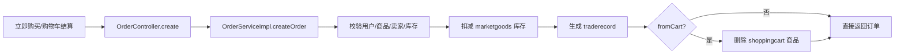

### 订单状态流转

订单当前使用三个主要状态：

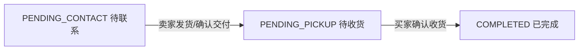

相关接口：

- 买家订单：`GET /api/orders/purchases`
- 卖家订单：`GET /api/orders/sales`
- 卖家发货：`POST /api/orders/{pid}/ship`
- 买家确认收货：`POST /api/orders/{pid}/receive`

## 九、收货地址流程

收货地址入口：

- 前端接口：`addressApi`
- 后端接口：`GET /api/addresses`、`POST /api/addresses`、`PUT /api/addresses/{id}`、`DELETE /api/addresses/{id}`
- 后端文件：`AddressController`、`AddressServiceImpl`、`AddressRepository`
- 数据表：`user_address`

地址功能支持列表、新增、编辑、删除和默认地址。设置某个地址为默认地址时，`AddressRepository` 会先把当前用户其他地址的 `IsDefault` 清空，再保存新的默认地址。

下单时不会直接把地址 ID 作为订单展示信息，而是把地址拼接成快照保存到 `traderecord.AddressSnapshot`，这样后续用户修改地址也不会影响历史订单。

## 十、收藏流程

收藏入口：

- 前端页面：`FavoritesPage.vue`
- 前端接口：`favoriteApi`
- 后端接口：`GET /api/favorites`、`POST /api/favorites/{gid}`、`DELETE /api/favorites/{gid}`
- 后端文件：`FavoriteController`、`FavoriteServiceImpl`、`FavoriteRepository`
- 数据表：`favorite_goods`

收藏商品时，后端会确认用户是普通用户、商品存在，并禁止收藏管理员商品。`FavoriteRepository.addFavorite` 会先判断是否已收藏，避免重复插入。

收藏列表会关联 `marketgoods`、`salegoods`、`user`，只返回当前仍为 `ACTIVE` 的商品。

## 十一、私信聊天流程

聊天入口：

- 前端页面：`MessagesPage.vue`
- 前端接口：`chatApi`
- 后端接口：`GET /api/chat/conversations`、`GET /api/chat/messages/{peerUid}`、`POST /api/chat/messages`
- 后端文件：`ChatController`、`ChatServiceImpl`、`ChatRepository`
- 数据表：`chat_message`

发送消息时，后端会校验发送者和接收者都是普通用户，消息内容不能为空，并且不能给自己发消息。消息可选关联商品 ID。

读取与某个用户的聊天记录时，后端会把对方发给当前用户的消息标记为已读，然后按消息 ID 正序返回双方消息。

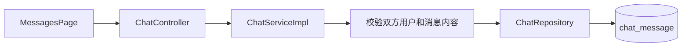

## 十二、求购信息流程

求购入口：

- 前端页面：`WantedPage.vue`
- 前端接口：`wantedApi`
- 后端接口：`GET /api/wanted/open`、`GET /api/wanted/mine`、`POST /api/wanted`、`POST /api/wanted/{id}/close`
- 后端文件：`WantedController`、`WantedServiceImpl`、`WantedRepository`
- 数据表：`wanted_post`

求购广场 `GET /api/wanted/open` 是公开接口。用户登录后可以发布自己的求购信息，也可以关闭自己的求购信息。

`WantedRepository` 查询求购时会额外匹配商品：根据求购分类、关键词去 `marketgoods` 中查找 `ACTIVE` 且库存大于 0 的商品，最多返回 6 个匹配商品，放到 `WantedVo.matches` 中。

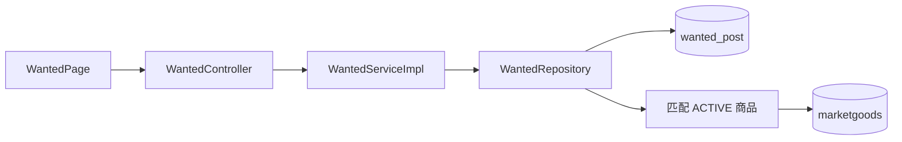

## 十三、个人资料与用户管理

普通用户资料：

- 前端页面：`ProfilePage.vue`
- 后端接口：`GET /api/profile`、`PUT /api/profile`、`PUT /api/profile/password`
- 后端文件：`ProfileController`、`ProfileServiceImpl`、`UserDao`

用户可以查看和修改用户名、邮箱、手机号、真实姓名、头像、个人简介，也可以修改密码。密码会通过 MD5 后保存。

管理员用户管理：

- 前端页面：`AdminUsersPage.vue`
- 后端接口：`GET /api/admin/users`、`PUT /api/admin/users/{uid}`、`POST /api/admin/users/{uid}/reset-password`、`POST /api/admin/users/{uid}/disable`
- 后端文件：`AdminApiController`、`AdminUserServiceImpl`

管理员可以查看普通用户、修改用户资料、重置用户密码、停用用户。停用用户时，该用户发布的商品会被同步封禁。

## 十四、数据库表与主要业务对象

| 表 | 主要用途 | 相关代码 |
| --- | --- | --- |
| `user` | 用户账号、资料、状态、校园认证 | `MarketUser`、`UserDao` |
| `marketgoods` | 商品主体信息、价格、库存、状态、图片路径 | `MarketGoods`、`GoodsDao` |
| `salegoods` | 卖家 UID 与商品 GID 的关联 | `SalesDao` |
| `shoppingcart` | 用户购物车 | `CarDao` |
| `traderecord` | 订单/交易记录 | `TradeRecord`、`RecordDao`、`SRecordDao` |
| `user_address` | 用户收货地址 | `AddressRepository` |
| `favorite_goods` | 用户收藏商品 | `FavoriteRepository` |
| `chat_message` | 用户私信消息 | `ChatRepository` |
| `goods_category` | 商品分类 | `CategoryRepository` |
| `wanted_post` | 求购信息 | `WantedRepository` |

`DatabaseMigrationService` 会在 Spring 容器启动时补充部分新字段和新表，并初始化默认商品分类。这个设计方便课程项目本地演示，但后续如果要做更正式的项目，可以考虑迁移到专门的数据库版本管理工具。

## 十五、当前设计中值得后续重点审核的地方

1. 数据访问层目前是 MyBatis DAO 和 JdbcTemplate Repository 混合使用，功能已经能拆清楚，但技术风格还没有完全统一。
2. 图片当前保存到 Web 应用的 `/img` 目录，适合本机课程演示；如果以后部署到服务器或云端，需要考虑外部上传目录或对象存储。
3. 商品列表目前在 Service 中做部分过滤、排序和分页；数据量变大后可以改成 SQL 分页查询。
4. 订单状态目前较简单，适合演示“联系/交付/完成”流程；如果后续需要退款、取消、评价，需要扩展订单状态机。
5. 当前测试目录没有有效自动化测试，后续可以优先给登录、发布商品、审核商品、下单这些主流程补测试。
